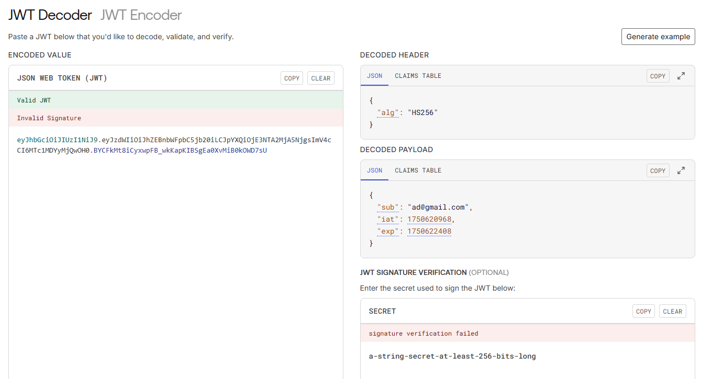
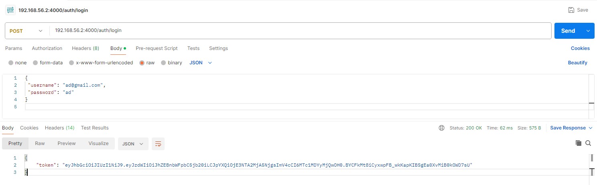
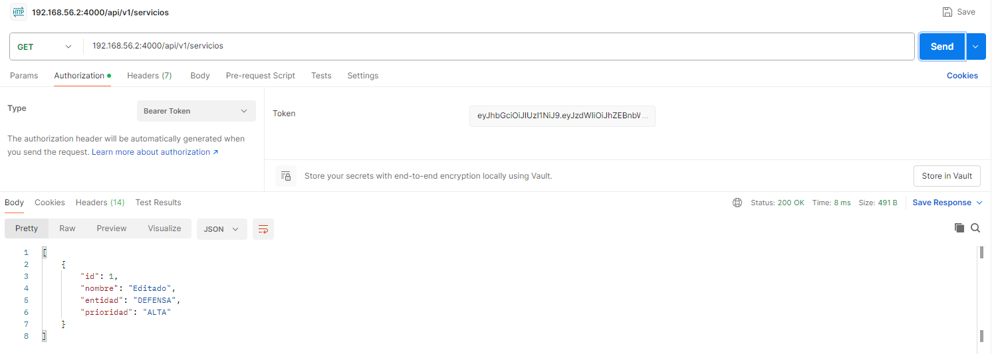
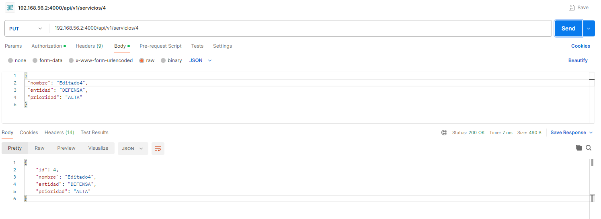

# API-CRUD

# Configuracion del token
- El token jwt tiene como duracion unos 23 minutos
<br>



<br>

# Paso 1 - Iniciar sesion para generar el token del usuario 

Endpoint:

```cmd
http://localhost:4000/auth/login

```


```cmd
{
 "username": "ad@gmail.com",
 "password": "ad"
}


```

<br>



<br>

# Paso 2 - Peticion GET servicios disponibles
- En el apartado de Authorization -> bearer token - Colocar el token generado en /login para poder llamar mediante una peticion GET a los servicios disponibles 


<br>



<br>

# Paso 3 - Nuevo servicio POST
- Agregar un nuevo servicio mediante Peticiones POST y agregando un cuerpo en Body de tipo JSON

```cmd
{
 "nombre": "Ciberseguridad",
 "entidad": "DEFENSA",
 "prioridad": "ALTA"
}

```

<br>


<br>

# Paso 4 - Editar Servicio PUT
- Editar el servicio previamanet agregado id = 4 /api/v1/servicios/4
- se puede cambiar el id segun que servicio se quiera editar **/api/v1/servicios/{id_service}**

```cmd
{
 "nombre": "Editado4",
 "entidad": "DEFENSA",
 "prioridad": "ALTA"
}

```

<br>



<br>

# Paso 5 - Eliminar servicio DELETE
- Eliminar el servicio previamanet agregado id = 4 /api/v1/servicios/4
- se puede cambiar el id segun que servicio se quiera eliminar **/api/v1/servicios/{id_service}**

<br>


<br>


